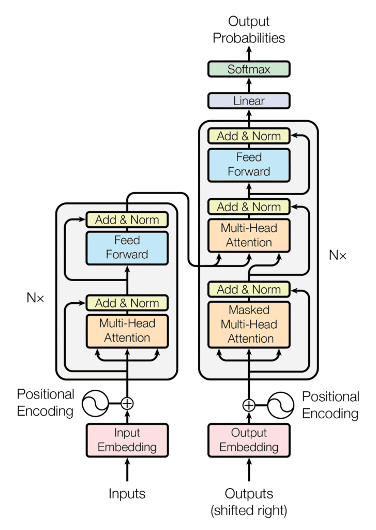
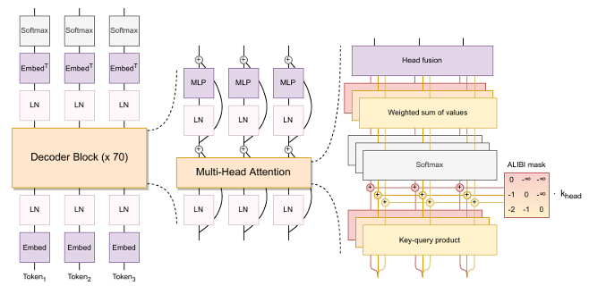

# **AcaQAS: An Academic Question Answering System Based on Finetuning Large Language Models**
## Proposed architectures

### The Transformer architecture

### Bloom architecture

## Datasets:
Pile dataset 
Website to the [original dataset](https://github.com/EleutherAI/the-pile)
## Result

| Prompt |	Response |
| ------------- | -------------|
|Solve for x: 2x+5=15.	| x = 5. |
| In calculus, what is the derivative of the function f(x) = e2x? |	The derivative of f ′(x) = 2e2x? |
| What is the derivative of f(x)=x3+2x with respect to x?	| The derivative is f ′(x)=3x2+2
| Define the term "Big O notation" in algorithm analysis.	| Big O notation describes the upper bound of an algorithm's time or space complexity, representing its worst-case growth rate relative to input size.
| Define the concept of a prime number.	 | A prime number is a natural number greater than 1 that has no positive divisors other than 1 and itself.

### Evaluation Results of Fine-Tuned Models on Academic QA Task
| Model	Accuracy (%)	| Precision (%)	| Recall (%)	| F1 Score (%)
| ------------- | ------------- |------------- |------------- |
| LLaMA-7B (Pre-Fine-Tuning) |	68.5 |	70.2 |	66.8 |	68.4 |
| LLaMA-7B (Post-Fine-Tuning) |	78.9 |	80.7 |	77.5 |	79.1 |
| Bloomz (Pre-Fine-Tuning)	| 69.3	| 71.0 |	67.2 |	69.0 |
| Bloomz (Post-Fine-Tuning) |	81.2 |	83.5 |	79.8 |	81.6 |

### AI Evaluation Results Using LLM Arbitration (GPT-4o) on MT-Bench Reasoning Set
| Model	Average Relevance Score |	Average Helpfulness Score |	Average Accuracy Score |	Average Level of Detail Score |	Overall Average Score (1-10) |
| ------------- | ------------- |------------- |------------- |------------- |
| Bloomz (Pre-Fine-Tuning) |	6.3 |	6.0 |	5.8 |	6.1 |	6.05 |
| Bloomz (Post-Fine-Tuning) |	8.0	| 8.2 |	8.1 |	8.0 |	8.08 |
| LLaMA-7B (Pre-Fine-Tuning) |	6.1 |	5.9 |	5.7 |	5.8	| 5.88 |
| LLaMA-7B (Post-Fine-Tuning) |	7.7 |	7.8 |	7.5 |	7.6 |	7.65 |

### 🔧 Training Configuration

| Parameter                    | Value                          |
|-----------------------------|---------------------------------|
| **Model**                   | Bloomz-mt-7B / LLaMA-7B         |
| **GPU Environment**         | Google Colab Pro (Tesla T4, 16GB VRAM) |
| **LoRA Rank**               | 8                               |
| **LoRA Alpha**              | 16                              |
| **LoRA Dropout**            | 0.05                            |
| **Number of Epochs**        | 3                               |
| **Batch Size**              | 4 (gradient accumulation = 8)   |
| **Learning Rate**           | 2e-4                            |
| **Optimizer**               | AdamW                           |
| **Scheduler**               | Linear with warmup              |
| **Warmup Ratio**            | 0.03                            |
| **Sequence Length**         | 512 tokens                      |
| **Gradient Clipping**       | 1.0                             |
| **Precision**               | 8-bit (`bitsandbytes`)          |
| **Frameworks**              | PyTorch, Hugging Face Transformers |
| **Training Duration**       | ~6 hours per model              |

